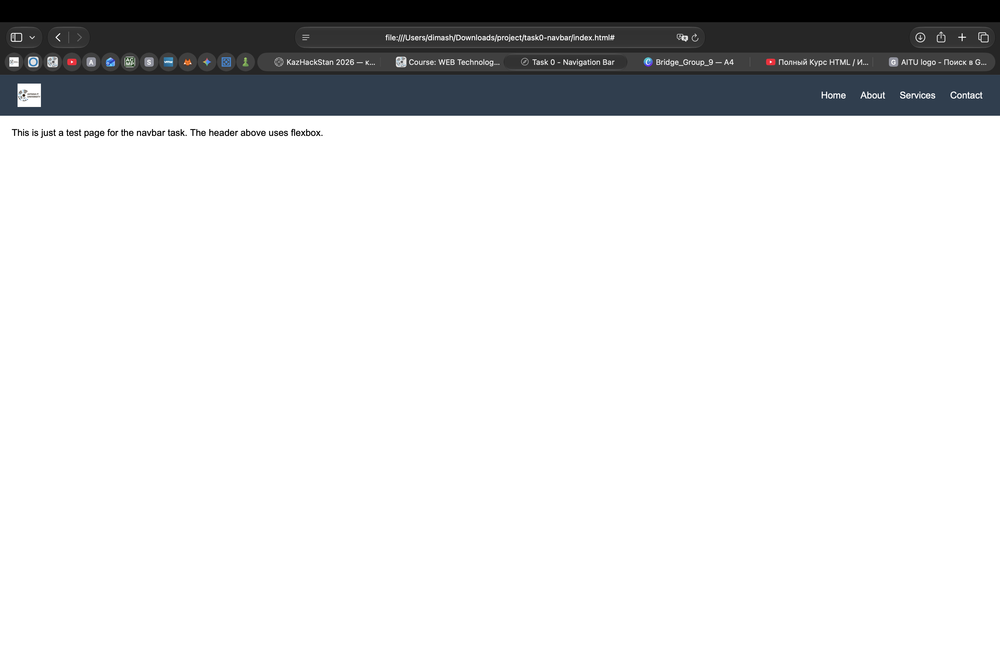
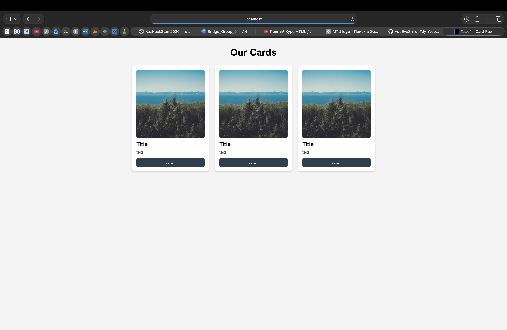
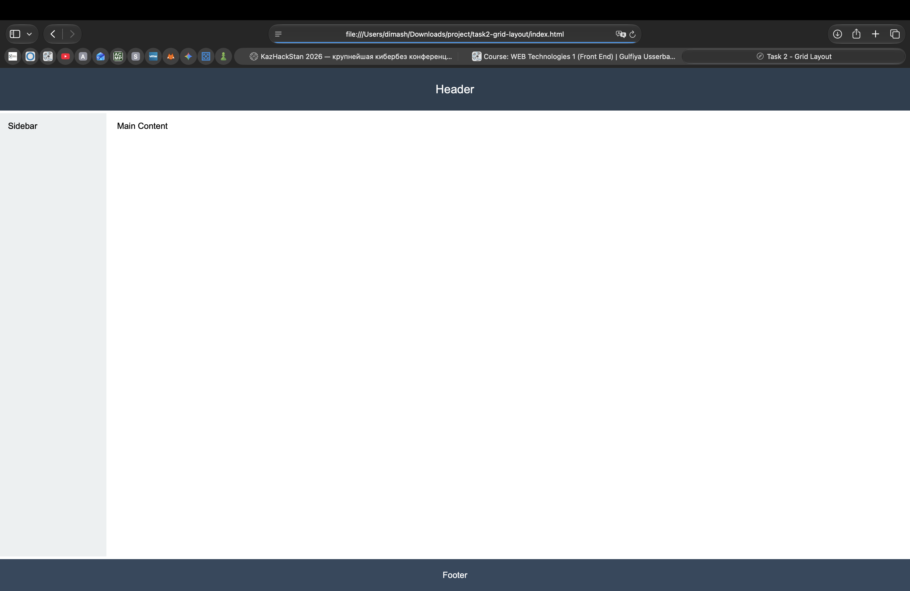
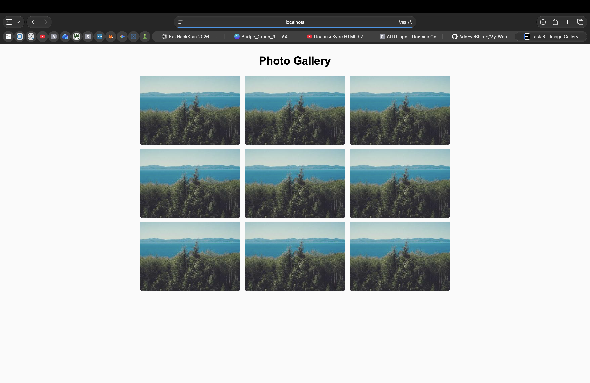
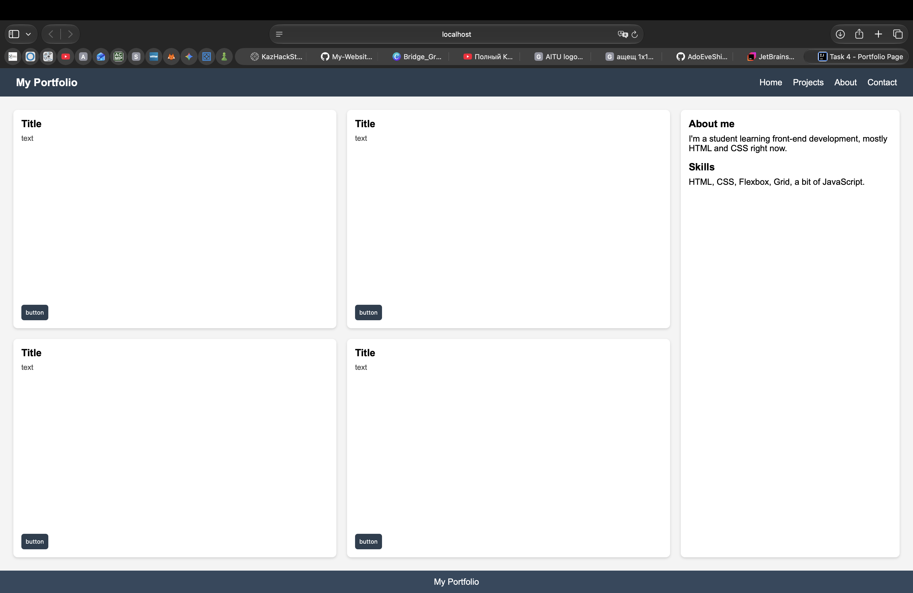

# Assignment 2 - Advanced CSS (Flexbox & Grid)

**Name:** Dinmukhammed Dauletkhan
**Group:** SE-2538

## Task 0 - Navigation Bar
A header with a logo on the left and nav links on the right, built with Flexbox (`justify-content: space-between`, `align-items: center`).

Screenshot:

## Task 1 - Card Row
Three cards in a row using Flexbox, equal height, gap between them, and a hover lift effect.

Screenshot:

## Task 2 - Page Layout with Grid Areas
Header / sidebar / main / footer layout built with CSS Grid and `grid-template-areas`.

Screenshot:

## Task 3 - Image Gallery
A 3-column grid gallery with 9 images and a caption overlay that appears on hover.

Screenshot:

## Task 4 - Portfolio Page
Combines Flexbox (header nav) and Grid (main section: projects grid on the left, sidebar on the right). Project cards use Flexbox internally to arrange title, text and button.

Screenshot:

## Summary
In this assignment I practiced building layouts with Flexbox and CSS Grid instead of floats. The navbar and card row were pretty straightforward with Flexbox, especially using justify-content and gap for spacing. The grid layout task took a bit more time because I had to understand how grid-template-areas connects to the actual HTML elements. The image gallery hover effect was fun to figure out, using position: relative/absolute for the caption overlay. Overall, Flexbox felt more natural for one-dimensional layouts (like a row of items), while Grid was better for structuring the whole page with multiple sections at once.
